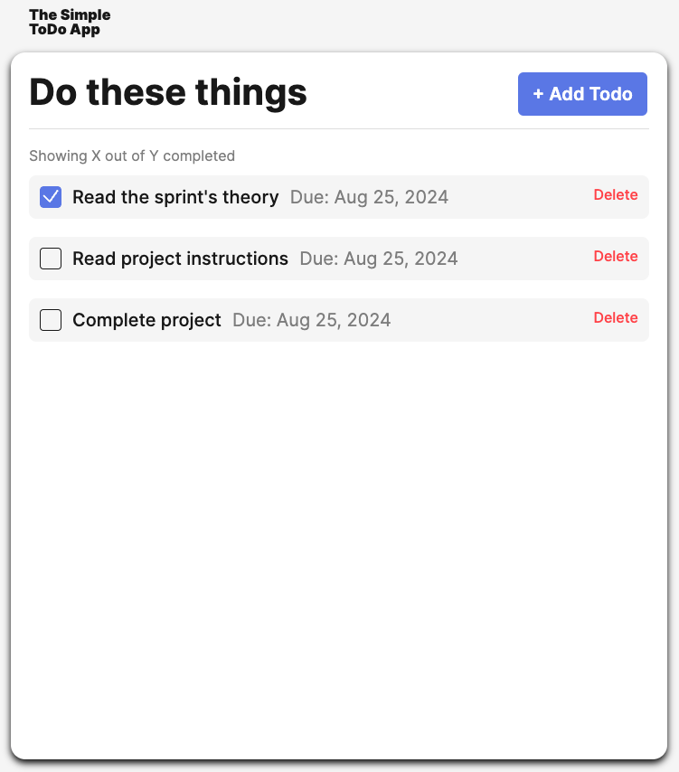
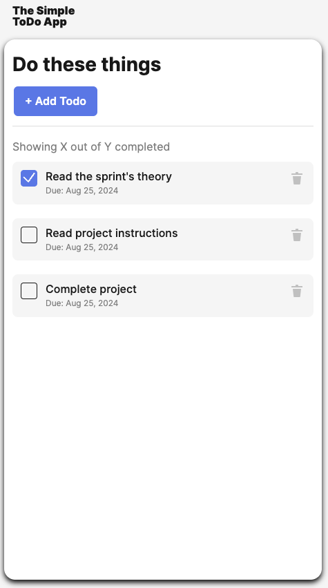

# Simple Todo App

# Project Snapshots

# Description

This application allows users to add their own to-do list items with specific dates for completion. It also allows users to check off when those list items have been completed and delete items that are no longer necessary.

## Tech Stack

- Semantic HTML5
- CSS
- Media Queries
- Flexbox
- JavaScript
- JS Classes

## Deployment

Feel free to view the completed project by clicking the [link here.](https://brogers111.github.io/se_project_todo-app/)

## Future Improvements

- Editing existing to-do list items
- User sign-in (login/logout functionality)
